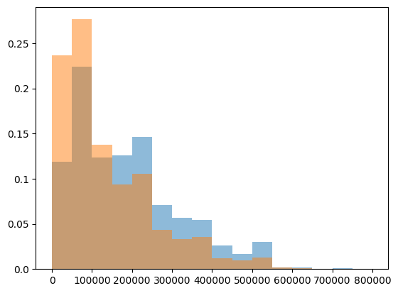
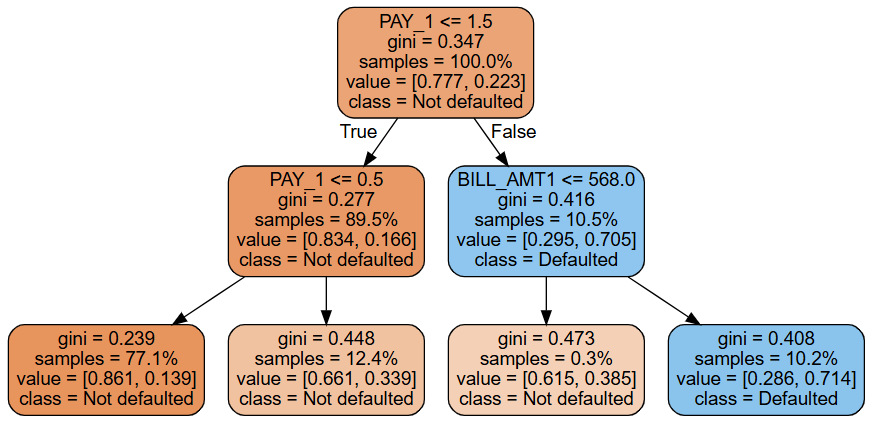

# Credit-Default-Prediction

Este projeto consiste na análise de dados de uma empresa de cartão de crédito, que disponibilizou informações financeiras e comportamentais de 30 mil clientes ao longo de um período de 6 meses.
O principal objetivo deste estudo é o desenvolvimento de um modelo preditivo que seja capaz de antecipar a inadimplência de um cliente, ou seja, prever se determinada conta apresentará ou não atraso no pagamento no próximo mês.
Essa previsão é fundamental para que a empresa consiga mitigar riscos financeiros, ajustar suas políticas de concessão de crédito e adotar medidas preventivas, como redefinir limites de crédito, oferecer renegociação ou até mesmo negar novas compras a clientes com alto risco de inadimplência.
O modelo de machine learning que será desenvolvido terá como variável alvo a inadimplência no pagamento, uma variável binária que indica se o cliente ficou ou não inadimplente no período analisado. A partir disso, será possível gerar previsões com alto potencial de auxiliar a empresa na tomada de decisões estratégicas e na gestão de riscos.
Esse tipo de análise é muito utilizado no setor financeiro, especialmente por bancos e operadoras de crédito, para melhorar a eficiência operacional e garantir a sustentabilidade financeira da organização.

## 1. Descrição

Este é um projeto de machine learning de ponta a ponta que tem como objetivo prever a **probabilidade de inadimplência** de clientes de um serviço de cartão de crédito. O modelo de classificação é treinado com dados rotulados, onde o alvo é `1` caso o cliente se torne inadimplente no mês seguinte e `0` caso contrário.

A análise foi desenvolvida inicialmente em **notebooks Jupyter**, abordando todas as etapas do pipeline de ciência de dados: da **análise exploratória (EDA)** à **seleção de variáveis** e **modelagem preditiva**. Em seguida, o projeto foi estruturado de forma **modular**, com componentes separados para **ingestão de dados**, **transformação** e **treinamento do modelo**, permitindo organização e reprodutibilidade.

Com base nesses componentes, foram implementados scripts para **automação das etapas de treinamento e predição**, facilitando a reexecução e possíveis integrações futuras. Foram seguidas boas práticas como:

- Uso de ambientes virtuais para isolamento de dependências;
- Tratamento de exceções e geração de logs;
- Documentação clara de scripts, funções e classes;
- Estrutura de código limpa e bem organizada.

Embora **não tenha sido implementada uma API** neste projeto, sua estrutura modular permite fácil adaptação para esse tipo de integração, o que aproxima a solução de um **fluxo realista de trabalho em projetos de ciência de dados**.

---

## 2. Tecnologias e ferramentas utilizadas

As tecnologias e ferramentas utilizadas incluem:

- **Linguagem**: Python  
- **Bibliotecas**: `Pandas`, `NumPy`, `Matplotlib`, `Seaborn`, `Scikit-learn`  
- **Ambientes**: `Jupyter Notebook`, `Visual Studio Code`, `Anaconda`  
- **Controle de Versão**: `Git` e `GitHub`  

### Técnicas aplicadas:
- Classificação supervisionada  
- Estatística descritiva e teste ANOVA (F-test)  
- Avaliação com métricas como **precisão**, **recall**, **F1-score**  
- Análise da **distribuição de probabilidades previstas** e **curvas de threshold**

## 3. Problema de Negócio e Objetivo do Projeto

### 3.1 Qual é o problema de negócio?

Um banco está enfrentando dificuldades crescentes com clientes que não conseguem cumprir com os pagamentos mínimos de seus cartões de crédito, gerando inadimplência. A equipe de risco e crédito está em busca de soluções que ajudem a identificar, de forma antecipada, quais clientes têm maior probabilidade de se tornarem inadimplentes. Com essas informações, o banco poderá agir de forma proativa para mitigar riscos e reduzir prejuízos financeiros.

---

### 3.2 Qual é o contexto?

Quando um banco fornece crédito a um cliente, é fundamental monitorar e gerenciar indicadores de risco. Três indicadores-chave (KPIs) nesse processo são:

- **Taxa de Inadimplência (Default Rate):** Percentual de clientes que deixam de cumprir com suas obrigações financeiras em determinado período.
- **Custo de Crédito (Credit Cost):** Despesas que o banco incorre ao conceder crédito, incluindo perdas com inadimplentes e provisões para devedores duvidosos.
- **Retorno Ajustado ao Risco (RAROC):** Métrica que relaciona o retorno obtido sobre o capital ajustado ao risco da operação.

Para maximizar sua rentabilidade, o banco deve **reduzir a inadimplência**, **minimizar o custo de crédito** e **aumentar a eficiência das concessões**. Modelos preditivos são aliados estratégicos nesse desafio, permitindo maior precisão na concessão e monitoramento de crédito.

---

### 3.3 Quais são os objetivos do projeto?

- Identificar os principais fatores associados à inadimplência.
- Construir um modelo capaz de prever a probabilidade de um cliente se tornar inadimplente no mês seguinte.
- Fornecer insights e estratégias para ajudar o banco a reduzir sua taxa de inadimplência.
- Visualizar e interpretar os resultados do modelo com base em métricas e gráficos de apoio.

---

### 3.4 Quais são os benefícios do projeto?

- **Redução de prejuízos financeiros** relacionados a não pagamento de dívidas.
- **Melhoria na concessão de crédito**, com decisões mais informadas.
- **Ações preventivas** mais direcionadas para clientes em risco.
- **Aumento da eficiência operacional** do setor de análise de crédito.
- **Proteção da receita** e maior sustentabilidade financeira.

---

### 3.5 Conclusão

Ao implantar o modelo em ambiente produtivo, o objetivo principal é gerar **escores de probabilidade de inadimplência para cada cliente**. Essa abordagem é mais valiosa do que classificações binárias (inadimplente/não inadimplente), pois permite uma **gestão mais estratégica do risco**.

Por exemplo, com base na probabilidade prevista, o banco pode:

- Priorizar campanhas de renegociação para clientes com alto risco;
- Ajustar limites de crédito;
- Aplicar políticas de retenção personalizadas.

Dessa forma, a instituição financeira toma decisões mais inteligentes e **baseadas em dados**, aumentando a rentabilidade e a segurança de suas operações.

## 4. Pipeline da Solução

O pipeline adotado neste projeto segue a metodologia **CRISP-DM (Cross Industry Standard Process for Data Mining)**, uma abordagem estruturada amplamente utilizada em projetos de ciência de dados. As etapas aplicadas foram:

1. **Definição do problema de negócio**  
   Identificar clientes com alta probabilidade de inadimplência e fornecer subsídios para que o banco atue preventivamente.

2. **Coleta e compreensão dos dados**  
   Utilização de um conjunto de dados real com informações financeiras e comportamentais de 30 mil clientes, contendo atributos como limite de crédito, histórico de pagamento, valores de faturas e pagamentos realizados.

3. **Divisão em conjunto de treino e teste**  
   Separação dos dados para garantir avaliação imparcial do modelo e evitar overfitting.

4. **Análise exploratória dos dados (EDA)**  
   Investigação de correlações, identificação de outliers, comportamento das variáveis em relação à inadimplência e visualizações estatísticas.

5. **Engenharia de atributos e pré-processamento**  
   Inclusão de variáveis derivadas, limpeza de dados, normalização e transformação para otimizar a performance dos algoritmos.

6. **Treinamento, seleção e avaliação de modelos**  
   Aplicação de modelos de classificação supervisionada, uso de teste ANOVA para seleção de variáveis relevantes, comparação de métricas e ajustes de thresholds.

7. **Teste e validação do modelo final**  
   Avaliação com base em métricas como precisão, recall, F1-score e análise da distribuição das probabilidades previstas.

8. **Conclusão e interpretação dos resultados**  
   Interpretação dos padrões encontrados, identificação dos fatores mais relevantes e proposta de estratégias de mitigação de risco.

> Todas as etapas serão explicadas detalhadamente dentro do readme.md e nos notebooks, com o racional por trás das decisões tomadas em cada fase do desenvolvimento.

## 5. Análise das variáveis idade e limite de crédito
.png)
## Histograma da variável `AGE` (Idade)

### O que mostra:
- A maioria dos clientes está na faixa entre **25 e 40 anos**.
- A frequência **diminui gradualmente** após os 40.
- Há **pouquíssimos clientes acima dos 60 anos**.

### Conclusão:
A base de dados é predominantemente composta por **adultos jovens e de meia-idade**. Pode ser interessante verificar:
- Se a **inadimplência muda com a idade**.
- Se essa variável tem **correlação com o comportamento de crédito**.

## Histograma da variável `LIMIT_BAL` (Limite de crédito)

### O que mostra:
- A maioria dos clientes tem limite de até **200.000**.
- O pico ocorre abaixo de **100.000**, e vai **caindo à medida que o limite aumenta**.
- Limites muito altos (**> 500.000**) são **raros**.

### Conclusão:
A distribuição é **assimétrica à direita** (muito concentrada em valores baixos). Isso indica que:
- **Limites baixos são muito comuns**.
- Poucos clientes têm acesso a **grandes linhas de crédito**.

---

## 6. Taxa de inadimplência por nível de escolaridade
.png)
### O que o gráfico mostra:
O eixo X representa os **níveis de escolaridade**, codificados numericamente:

- **1**: Educação básica (ex: ensino fundamental)  
- **2**: Ensino médio  
- **3**: Ensino superior incompleto  
- **4**: Ensino superior completo ou pós-graduação  

O eixo Y mostra a **taxa de inadimplência** (proporção de clientes inadimplentes) em cada grupo.

### Conclusões:
- Clientes com **nível 3** (superior incompleto?) têm a **maior taxa de inadimplência**, acima de **25%**.
- Em seguida, o **nível 2** (ensino médio) também apresenta inadimplência elevada (~23%).
- O **nível 1** (educação básica) tem inadimplência menor do que os níveis 2 e 3, mas ainda significativa (~19%).
- O **nível 4** (superior completo/pós) apresenta a **menor taxa**, por volta de **7%**.

### Interpretação:
- A inadimplência parece estar **inversamente relacionada ao nível de escolaridade**.
- Pessoas com **maior escolaridade (nível 4)** têm **melhor comportamento de crédito**.
- Pode indicar **maior estabilidade financeira**, **educação financeira** ou **melhor renda** nesse grupo.

---

## 7. Taxa de inadimplência por status de pagamento (`PAY_1`)
.png)
### O que o gráfico mostra:
- O eixo X representa os valores da variável `PAY_1`, que indica o **atraso no pagamento** do mês mais recente.
  - `-2`, `-1`, `0`: pagamentos adiantados, em dia ou sem dívidas.
  - `1` a `8`: número de meses de atraso no pagamento.
- O eixo Y mostra a **proporção de clientes inadimplentes** (`y == 1`) para cada valor de `PAY_1`.

A linha vermelha representa a **taxa média geral de inadimplência** no conjunto de dados, usada como referência.

### Conclusões:
- Clientes com `PAY_1` igual a `-2`, `-1` ou `0` têm **inadimplência bem abaixo da média**, indicando bom histórico de pagamento.
- A inadimplência **aumenta rapidamente** a partir de `PAY_1 = 1`, atingindo o pico com `PAY_1 = 3` e `PAY_1 = 7` (acima de 75%).
- Clientes com histórico recente de atraso (≥1 mês) têm **muito maior probabilidade de se tornarem inadimplentes**.
- O padrão confirma que `PAY_1` é uma **variável altamente preditiva** da inadimplência.

### Interpretação:
- Há uma relação clara e **fortemente positiva** entre atraso nos pagamentos recentes e a chance de inadimplência.
- A variável `PAY_1` deve ser considerada uma **feature prioritária** em qualquer modelo de previsão de inadimplência.

---

## 8. Distribuição do limite de crédito (`LIMIT_BAL`) por situação de pagamento

### O que o gráfico mostra:
- Dois histogramas sobrepostos:
  - **Laranja**: clientes **inadimplentes** (`y == 1`)
  - **Azul**: clientes **adimplentes** (`y == 0`)
- O eixo X mostra os valores de **limite de crédito** (`LIMIT_BAL`), em faixas de 50.000 até 800.000.
- O eixo Y representa a **densidade relativa** (frequência normalizada para comparação).

### Conclusões:
- A maior parte dos **inadimplentes** está concentrada nos limites mais baixos (até **100.000**).
- Já os **adimplentes** estão mais distribuídos ao longo dos valores, inclusive em faixas mais altas (até **500.000**).
- Conforme o limite aumenta, a **proporção de inadimplentes diminui**.
- A distribuição é **assimétrica à direita**, com **poucos clientes com limites elevados**, mas predominância de bons pagadores entre eles.

### Interpretação:
- Existe uma **relação inversa entre limite de crédito e inadimplência**: quanto maior o limite, menor a chance de inadimplência.
- Isso pode indicar que instituições financeiras atribuem **limites maiores a clientes mais confiáveis**, com melhor histórico ou perfil de crédito.
- A variável `LIMIT_BAL` possui **potencial preditivo relevante** e pode ser importante para o modelo.

---

## 9. Árvore de Decisão para Previsão de Inadimplência

### O que o gráfico mostra:
Esta é uma árvore de decisão treinada para classificar clientes entre **inadimplentes** (`Defaulted`) e **adimplentes** (`Not defaulted`), usando variáveis como `PAY_1` e `BILL_AMT1`.

Cada nó mostra:
- A **condição de divisão** (ex: `PAY_1 <= 1.5`)
- O índice de **impureza Gini**
- A **proporção de amostras**
- A **distribuição de classes** (`value = [não inadimplentes, inadimplentes]`)
- A **classe majoritária** naquele nó

### Interpretação dos caminhos:

#### Nó Raiz:
- **Condição:** `PAY_1 <= 1.5`
- A maioria dos clientes **não está inadimplente** (`77.7%`)
- A árvore separa os clientes com pagamentos mais atrasados (`PAY_1 > 1.5`)

### Ramo da esquerda: `PAY_1 <= 1.5`
- **Subdivisão:** `PAY_1 <= 0.5`
  - Clientes com pagamentos em dia ou pequenos atrasos.
  - Quase todos **não inadimplentes**:
    - `gini = 0.239`
    - `86%` adimplentes

#### Ramo direito desse nó (`PAY_1 > 0.5 e <= 1.5`)
- Ainda predominância de não inadimplentes, mas com **gini mais alto (0.448)** — maior incerteza.

### Ramo da direita: `PAY_1 > 1.5`
- Passa a usar `BILL_AMT1 <= 568.0` (valor de fatura).
  - Clientes com **fatura baixa** (`BILL_AMT1 <= 568.0`) têm **alta taxa de inadimplência**:
    - `70.5%` inadimplentes
    - `gini = 0.416`
  - Já os que têm faturas altas (fora da condição) ainda apresentam **alta inadimplência (71.4%)**

### Conclusões:
- A variável **`PAY_1`** é **extremamente importante**: é usada na raiz e no primeiro nível.
- Clientes com `PAY_1 > 1.5` têm **risco significativamente maior**.
- A variável `BILL_AMT1` ajuda a refinar a previsão em clientes já classificados como arriscados.
- A maioria dos **inadimplentes** está concentrada nos caminhos à direita da árvore.

### Dica:
Você pode usar essa árvore:
- Para entender **regras simples de decisão**
- Para comunicar decisões a **stakeholders não técnicos**
- Ou como base para engenharia de features ou explicabilidade de modelos mais complexos

---

